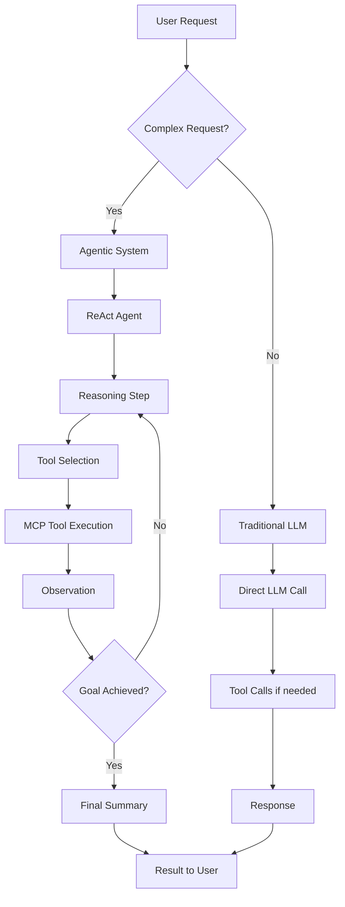

# Agentic Integration Guide

This guide explains how the Obsidian LLM Plugin integrates with **Simon Wilson's LLM CLI** and **Pocket Flow** to provide agentic capabilities using the **ReAct (Reasoning + Acting)** pattern.

## 🎯 **Overview**

The plugin now supports two modes of operation:

1. **Traditional Mode**: Direct LLM API calls (existing functionality)
2. **Agentic Mode**: ReAct agent system for complex multi-step tasks

## 🏗️ **Architecture**

### **Components Integration**

```
Obsidian Plugin
├── Traditional LLM Service (existing)
│   ├── Direct API calls to LLM backend
│   └── Simple tool calling via MCP
└── Agentic LLM Service (new)
    ├── Simon Wilson's LLM CLI
    ├── Pocket Flow framework
    ├── ReAct agent implementation
    └── MCP tool integration
```

### **Request Flow**



## 🚀 **Setup Instructions**

### **1. Install Agent System**

```bash
# Install the ReAct agent system
npm run install-agent

# Or manually
node scripts/install-agent.js
```

### **2. Install Python Dependencies**

The agent system requires Python and several packages:

```bash
# Navigate to agent directory
cd .obsidian/plugins/unofficial-llm-integration/agent

# Install dependencies
pip install -r requirements.txt
```

### **3. Install Simon Wilson's LLM CLI**

```bash
# Install LLM CLI
pip install llm

# Configure with your preferred models
llm keys set openai
llm keys set anthropic
```

### **4. Enable Agentic Mode**

1. Open Obsidian Settings
2. Go to "Unofficial LLM Integration"
3. Enable "Agentic Mode" toggle
4. Configure MCP servers in `settings.json`

## ⚙️ **Configuration**

### **Model Configuration**

The agent uses different models for different tasks:

```json
{
  "model_config": {
    "reasoning": "gpt-4o",      // For ReAct reasoning steps
    "summarization": "gpt-4o-mini", // For final summaries
    "default": "gpt-4o-mini"    // Fallback model
  }
}
```

### **MCP Integration**

The agent automatically discovers and uses MCP tools:

```json
{
  "mcpServers": {
    "youtube-transcript": {
      "command": "python",
      "args": ["/path/to/youtube_transcript_server.py"],
      "enabled": true
    },
    "filesystem": {
      "command": "npx",
      "args": ["-y", "@modelcontextprotocol/server-filesystem", "/path/to/files"],
      "enabled": true
    }
  }
}
```

## 🤖 **How Agentic Mode Works**

### **Request Classification**

The system automatically determines whether to use agentic processing:

**Agentic Triggers:**
- "analyze", "research", "investigate"
- "summarize video", "youtube"
- "help me with", "step by step"
- "find information", "extract data"

**Simple Requests:**
- Basic questions
- Simple calculations
- Direct information requests

### **ReAct Process**

1. **Tool Discovery**: Find available MCP tools
2. **Reasoning Loop**:
   - Analyze current situation
   - Decide next action
   - Execute tool if needed
   - Observe results
   - Repeat until goal achieved
3. **Final Summary**: Compile results into user-friendly response

### **Example Flow**

**User Request**: "Summarize this YouTube video: https://youtube.com/watch?v=example"

```
🔍 Tool Discovery: Found youtube-transcript tool
🤔 Reasoning Step 1: Need to get video transcript
🎬 Action 1: Call get_youtube_transcript(url="https://youtube.com/watch?v=example")
📊 Observation: Retrieved 5000 words of transcript
🤔 Reasoning Step 2: Need to summarize the content
📝 Final Summary: Generated comprehensive summary
```

## 🛠️ **Development**

### **Extending the Agent**

To add new capabilities:

1. **Add MCP Server**: Configure new tools in `settings.json`
2. **Update Agent Logic**: Modify reasoning prompts in `nodes.py`
3. **Add Model Profiles**: Create specialized model configurations

### **Custom Agent Implementation**

You can replace the default agent with your own:

```typescript
// In AgenticLLMService.ts
private async executeReActAgent(prompt: string, config: any): Promise<string> {
    // Your custom agent implementation
    return await this.runCustomAgent(prompt, config);
}
```

## 📊 **Performance Considerations**

### **When to Use Each Mode**

| Request Type | Recommended Mode | Reason |
|--------------|------------------|---------|
| Simple Q&A | Traditional | Faster, cheaper |
| Multi-step tasks | Agentic | Better reasoning |
| Tool-heavy workflows | Agentic | Automatic tool selection |
| Creative writing | Traditional | Direct generation |
| Research tasks | Agentic | Systematic approach |

### **Cost Optimization**

- **Fast Profile**: Use `gpt-4o-mini` for all tasks
- **Balanced Profile**: Mix of models based on task complexity
- **Powerful Profile**: Use `gpt-4o` for maximum quality

## 🔧 **Troubleshooting**

### **Common Issues**

1. **Agent Not Available**
   - Check Python installation
   - Verify dependencies installed
   - Check agent files exist

2. **Tool Execution Fails**
   - Verify MCP server configuration
   - Check tool permissions
   - Review server logs

3. **Poor Reasoning Quality**
   - Try different model profiles
   - Adjust max steps setting
   - Review reasoning prompts

### **Debug Mode**

Enable debug logging to see detailed agent execution:

```typescript
// In plugin settings
debug: true
```

## 🎯 **Best Practices**

### **For Users**

1. **Use descriptive requests**: "Help me analyze this video and extract key points"
2. **Specify desired output**: "Create a bullet-point summary"
3. **Provide context**: Include relevant background information

### **For Developers**

1. **Monitor token usage**: Agentic mode uses more tokens
2. **Implement fallbacks**: Always have traditional mode as backup
3. **Test thoroughly**: Verify agent behavior with various inputs
4. **Cache results**: Store expensive computations when possible

## 🚀 **Future Enhancements**

- **Memory System**: Persistent context across conversations
- **Multi-Agent Collaboration**: Specialized agents for different tasks
- **Custom Workflows**: User-defined agent behaviors
- **Advanced Tool Integration**: More sophisticated tool orchestration

This integration brings the power of agentic AI to Obsidian, enabling sophisticated multi-step reasoning and tool usage for complex tasks while maintaining the simplicity of direct LLM calls for basic requests.
